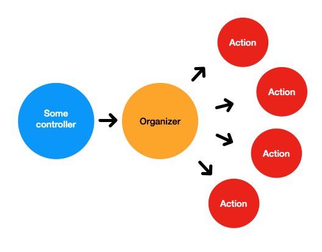
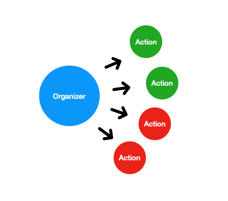
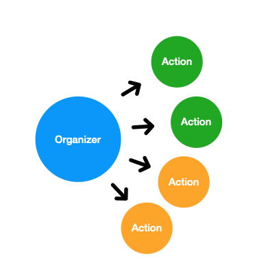

# LightService

<!-- 
[](https://github.com/douglasgreyling/light-service/actions)
[](undefined)
 -->

A service object framework heavily, heavily, heavily inspired by the [LightService](https://github.com/adomokos/light-service) Ruby gem.

This package ports over most of the awesome ideas in [LightService](https://github.com/adomokos/light-service) so that one can use it in JavaScript. If you're familiar with the Ruby version, then you should feel mostly at home with this package.

Be sure to check out the original [LightService](https://github.com/adomokos/light-service) if you ever find yourself in Ruby-land!

## Table of Content

- [Why LightService?](#why-lightservice)
- [How LightService works in 60 seconds](#how-lightservice-works-in-60-seconds)
- [Getting started](#getting-started)
  - [Requirements](#requirements)
  - [Installation](#installation)
  - [Your first action](#your-first-action)
  - [Your first organizer](#your-first-organizer)
- [Simplifying our first tax example](#simplifying-our-first-tax-example)
  - [The organizer](#the-organizer)
  - [Looking up the tax percentage](#looking-up-the-tax-percentage)
  - [Calculating the order tax](#calculating-the-order-tax)
  - [Providing free shipping (where applicable)](<#providing-free-shipping-(where-applicable)>)
  - [And finally, the controller](#and-finally-the-controller)
- [Caveats](#caveats)
- [Tips & Tricks](#tips-&-tricks)
  - [Stopping a series of actions](#stopping-a-series-of-actions)
  - [Hooks](#hooks)
  - [Expects and promises](#expects-and-promises)
  - [Context metadata](#context-metadata)
  - [Key aliases](#key-aliases)
  - [Logging](#logging)
  - [Error codes](#error-codes)
  - [Action rollback](#action-rollback)
- [Contributing](#contributing)
- [License](#license)

## Why LightService?

What do you think of this code?

```javascript
class TaxController extends SomeController {
  update(request, response) {
    const order = Order.find(request.id);
    const taxRanges = TaxRange.forRegion(order.region);

    if (taxRanges === undefined)
      return ...; // render some view

    const taxPercentage = taxRanges.forTotal(order.total);

    if (taxRanges === undefined)
      return ...; // render some other view

    order.tax = (
      context.order.total *
      (context.taxPercentage / 100)
    ).toFixed(2);;

    if (200 < order.totalWithTax)
      order.provideFreeShipping();

    return ...; // Redirect to some view with a flash message
  }
}
```

This controller violates the [SRP](http://en.wikipedia.org/wiki/Single_responsibility_principle). Can you imagine testing something like this?

In this instance we have a fairly simple controller, but one shudders to think what controllers could look like in more complex codebases out there in the wild.

You could argue that you could clean up this controller by moving the `taxPercentage` logic and calculations into a tax model, but then you'll be relying on heavy model logic.

If you've ever done debugging (haha, who hasn't?) you might find it difficult to determine what's going on and where you need to start. This is especially difficult when you have a high level overview of what the code does and what needs to happen to resolve your bug.

Wouldn't it be nice if your code was broken up into smaller pieces which tell you exactly what they do?

In the case with our controller above, it would be great if our code dispelled any confusion by telling us that it was doing 3 simple things in a specific sequence whenever an order is updated:

1. Looking up the tax percentage based on order total.
2. Calculating the order tax.
3. Providing free shipping if the total with tax is greater than \$200.

If you've ever felt the headache of fat controllers, difficult code to reason about, or seemingly endless rabbit holes, then this is where LightService comes in.

## How LightService works in 60 seconds:

There are 2 key things to know about when working with LightService:

1. Actions.
2. Organizers.

**Actions** are the building blocks of getting stuff done in LightService. Actions focus on doing one thing really well. They can be executed on their own, but you'll often seem them bundled together with other actions inside Organizers.

**Organizers** group multiple actions together to complete some task. Organizers consist of at least one action. Organizers execute actions in a set order, one at a time. Organizers use actions to tell you the 'story' of what will happen.

Here's a diagram to understand the relationship between organizers and actions:



## Getting started:

npm i @douglasgreyling/light-service

### Your first action:

Let's make a simple greeting action.

```javascript
import { Action } from "light-service";

class GreetsSomeoneAction extends Action {
  expects = ["name"];
  promises = ["greeting"];

  executed(context) {
    context.greeting = `Hello, ${context.name}. Solved any fun mysteries lately?`;
  }
}
```

Actions take an optional list of expected inputs and can return an optional list of promised outputs. In this case we've told our action that it expects to receive an input called `name`.

The `executed` function is the function which gets called whenever we execute/run our action. We can access the inputs available to this action through the `context` argument. Likewise, we can add/set any outputs through the context as well.

Once an action is run we can access the finished context, and the status of the action.

```javascript
const result = await GreetsSomeoneAction.execute({ name: "Scooby" });

if (result.success())
  console.log(result.greeting);

> "Hello, Scooby. Solved any fun mysteries lately?"
```

Actions try to promote simplicity. They either succeed, or they fail, and they have very clear inputs and outputs. They generally focus on doing one thing, and because of that they can be a dream to test!

### Your first organizer

Most times a simple action isn't enough. LightService lets you compose a bunch of actions into a single organizer. By bundling your simple actions into an organizer you can stitch very complicated business logic together in a manner that's very easy to reason about. Good organizers tell you a clear story!

Before we create out organizer, let's create one more action:

```javascript
class FeedsSomeoneAction extends Action {
  expects = ["name"];

  executed(context) {
    const snack = Fridge.fetch("Grapes");

    Person.find(context.name).feed(snack);
  }
}
```

Now let's create our organizer like this:

```javascript
import { Organizer } from "light-service";

class GreetsAndFeedsSomeone extends Organizer {
  static async call(name) {
    return this.with({ name }).reduce(GreetsSomeoneAction, FeedSomeoneAction);
  }
}

const result = await GreetsAndFeedsSomeone.call("Shaggy");
```

And that's your first organizer! It ties two actions together through a static function `call`. The organizer call function takes any name and uses it to setup an initial context (this is what the `with` function does). The organizer then executes each of the actions on after another with the `reduce` function.

As your actions are executed they will add/remove to the context you initially set up.

Just like actions, organizers return the final context as their return value.

```javascript
const result = await GreetsAndFeedsSomeone.call("Shaggy");

if (result.success()) {
  console.log('Time to stock up on snacks!');
}

> "Time to stock up on snacks!"
```

Because organizers generally run through complex business logic, and every action has the potential to cause a failure, testing an organizer is functionally equivalent to an integration test.

## Simplifying our first tax example:

Let's clean up the controller we started with by using LightService.

We'll begin by looking at the controller. We want to look for distinct steps which we can separate whenever we need to update the tax on an order. By doing this we notice 3 clear processes:

1. Look up the tax percentage based on order total.
2. Calculate the order tax.
3. Provide free shipping if the total with tax is greater than \$200.

#### The organizer:

```javascript
class CalculatesTax extends Organizer {
  static async call(order) {
    return this.with({ order }).reduce(
      LooksUpTaxPercentageAction,
      CalculatesOrderTaxAction,
      ProvidesFreeShippingAction
    );
  }
}
```

#### Looking up the tax percentage:

```javascript
class LooksUpTaxPercentageAction extends Action {
  expects = ["order"];
  promises = ["taxPercentage"];

  executed(context) {
    const order = context.order;
    const taxRanges = TaxRange.forRegion(order.region);

    context.taxPercentage = 0;

    if (taxRanges === undefined) {
      context.fail("The tax ranges were not found");
      this.nextContext();
    }

    const taxPercentage = taxRanges.forTotal(order.total);

    if (taxPercentage === undefined) {
      context.fail("The tax percentage were not found");
      this.nextContext();
    }

    context.taxPercentage = taxPercentage;
  }
}
```

#### Calculating the order tax:

```javascript
class CalculatesOrderTaxAction extends Action {
  expects = ["order", "taxPercentage"];

  executed(context) {
    context.order.tax = (
      context.order.total *
      (context.taxPercentage / 100)
    ).toFixed(2);
  }
}
```

#### Providing free shipping (where applicable):

```javascript
class ProvidesFreeShippingAction extends Action {
  expects = ["order"];

  executed(context) {
    const totalWithTax = context.order.totalWithTax();

    if (200 < totalWithTax) {
      context.order.provideFreeShipping();
    }
  }
}
```

#### And finally, the controller:

```javascript
class TaxController extends Controller {
  async update(request, response) {
    const order = Order.find(request.id);

    const result = await CalculatesTax.call(order);

    if (result.failure()) {
      return ...; // render some view
    } else {
      return ...; // Redirect to some view with a flash message
    }
  }
}
```

## Caveats:

LightService is really useful when you need to put together a series of functions in order create an elegant processing pipeline. Javascript will make this a little more challenging given that it implements asynchronous code.

This implementation of LightService assumes that asynchronous code is present in your actions & organizers (even if it isn't) in order to sequentially execute action.

Because of this your an actions/organizers will **ALWAYS** return a promise.

## Tips & Tricks:

### Stopping a series of actions

When nothing unexpected happens during the organizer's call, the returned context will be successful. Here is how you can check for this:

However, sometimes not everything will play out as you expect it. An external API call might not be available or some complex business logic will need to stop the processing of a series of actions. You have two options to stop the call chain:

1. Failing the context
2. Skipping the rest of the actions

#### Failing the context:

When something goes wrong in an action and you want to halt the chain, you need to call `fail()` on the context object. This will push the context in a failure state (`context.failure()` will evaluate to true). The context's `fail` function can take an optional message argument, this message might help describe what went wrong. In case you need to return immediately from the point of failure, you have to do that by calling next context.

In case you want to fail the context and stop the execution of the executed block, use the `failAndReturn('something went wrong')` function. This will immediately fail the context and cause the execute function to return.

Here's an example:

```javascript
class SubmitsOrderAction extends Action {
  executed(context) {
    if (!context.order.submitOrderSuccessful()) {
      context.failAndReturn("Failed to submit the order");
    }

    // This won't be executed
    context.mailer.sendOrderNotification();
  }
}
```

Let's imagine that in the example above the organizer could have called 4 actions. The first 2 actions were executed until the 3rd action failed, and pushed the context into a failed state and so the 4th action was skipped.



#### Skipping the rest of the actions

You can skip the rest of the actions by calling `skipRemaining()` on the context. This behaves very similarly to the above-mentioned fail mechanism, except this will not push the context into a failure state. A good use case for this is executing the first couple of actions and based on a check you might not need to execute the rest. Here is an example of how you do it:

```javascript
class ChecksOrderStatusAction extends Action {
  executed(context) {
    if (context.order.mustSendNotification()) {
      context.skipRemaining(
        "Everything is good, no need to execute the rest of the actions"
      );
    }
  }
}
```

Let's imagine that in the example above the organizer called 4 actions. The first 2 actions got executed successfully. The 3rd decided to skip the rest, the 4th action was not invoked. The context was successful.



### Hooks

In case you need to inject code right before, after or even around actions (or even around), then hooks could be the droid you're looking for. This addition to LightService is a great way to decouple instrumentation from business logic.

Consider this code:

```javascript
class SomeOrganizer extends Organizer {
  static async call(context) {
    return this.with(context).reduce(...this.actions());
  }

  static actions() {
    return [OneAction, TwoAction, ThreeAction];
  }
}

class TwoAction extends Action {
  executed(context) {
    if (context.user.role == "admin")
      context.logger.info("admin is doing something");

    context.user.doSomething();
  }
}
```

The logging logic makes `TwoAction` more complex, there is more code for logging than for business logic.

You have three options to include hooks so you can decouple instrumentation from real logic with `beforeEach`, `afterEach` and `aroundEach` hooks:

This is how you can declaratively add before and after hooks to the organizer:

```javascript
class SomeOrganizer extends Organizer {
  beforeEach(context) {
    if (context.currentAction() == TwoAction) {
      if (context.user.role != "admin") return;

      context.logger.info("admin is doing something");
    }
  }

  afterEach(context) {
    if (context.currentAction() == TwoAction) {
      if (context.user.role != "admin") return;

      context.logger.info("admin is doing something");
    }
  }

  aroundEach(context) {
    context.logger.info("admin is about to do (or already has done) something");
  }

  static async call(context) {
    return this.with(context).reduce(...this.actions());
  }

  static actions() {
    return [OneAction, TwoAction, ThreeAction];
  }
}

class TwoAction extends Action {
  executed(context) {
    context.user.doSomething();
  }
}
```

Note how the action has no logging logic after this change. Also, you can target before and after action logic for specific actions, as the `context.currentAction()` will have the class name of the currently processed action. In the example above, logging will occur only for `TwoAction` and not for `OneAction` or `ThreeAction`.

### Expects and promises

The expects and promises functions are rules for the inputs/outputs of an action. `expects` describes what keys it needs to exist inside the context for the action to execute and finish successfully. `promises` makes sure the keys are in the context after the action has been executed. If either of them are violated, a custom exception is thrown.

This is how it's used:

```javascript
class FooAction extends Action {
  expects = ["a", "b"];
  promises = ["c"];

  executed(context) {
    context.c = context.a + context.b;
  }
}
```

Expects can also be an object. This allows you to pass additional arguments like default values:

```javascript
class FooAction extends Action {
  expects = { fields: ["a", "b"], defaults: { a: 1 } };
  promises = ["c"];

  executed(context) {
    context.c = context.a + context.b;
  }
}
```

The default will only be set if the expected field is undefined within the context.

Acceptable defaults also include functions.

### Context

The context returned by actions & organizers include some handy helper functions such as the following:

1. The current action (`context.currentAction();`)
2. The current organizer (`context.currentOrganizer();`)
3. The failure status of the context (`context.failure();`)
4. The success status of the context (`context.success();`)
5. The failure message if it exists (`context.message();`)

Also, take advantage of destructuring as much as possible. You can still refer to and mutate the context via `this` like the following:

```javascript
class FooAction extends Action {
  expects = ["a", "b"];
  promises = ["c"];

  executed({ a, b }) {
    this.context.c = a + b;
  }
}
```

### Key aliases

The `aliases` property allows you to create an alias for a key found inside the organizers context. Actions can then access the context using the aliases.

This allows you to put together existing actions from different sources and have them work together without having to modify their code. Aliases will work with, or without, action expects.

If a key alias is set for a key which already exists inside the context, then an exception is raised.

Say for example you have actions `AnAction` and `AnotherAction` that you've used in previous projects. `AnAction` provides `myKey` but `AnotherAction` needs to use that key but expects it to be called `keyAlias` instead. You can use them together in an organizer like so:

```javascript
class AnOrganizer extends Organizer {
  aliases = { myKey: "keyAlias" };

  static async call(order) {
    return this.with({ order }).reduce(AnAction, AnotherAction);
  }
}

class AnAction extends Action {
  promises = ["myKey"];

  executed(context) {
    context.myKey = "value";
  }
}

class AnotherAction extends Action {
  expects = ["keyAlias"];

  executed(context) {
    context.keyAlias;
  }
}
```

### Error codes

You can add some more structure to your error handling by taking advantage of error codes in the context. Normally, when something goes wrong in your actions, you fail the process by setting the context to failure:

```javascript
class SomeAction extends Action {
  executed(context) {
    context.fail("I don't like what happened here.");
  }
}
```

However, you might need to handle the errors coming from your action pipeline differently. Using an error code can help you check what type of expected error occurred in the organizer, or in the actions.

```javascript
class SomeAction extends Action {
  executed(context) {
    if (95 < context.teapot.heat())
      context.fail("The teapot is not hot enough", { errorCode: 1234 });

    // Make some tea

    if (2 < context.sugar.amount())
      context.fail("There is not enough sugar for the tea", {
        errorCode: 5678,
      });
  }
}
```

If this action were executed, then you can pull the error message like you would normally, but you can also retrieve the error code.

```javascript
const result = await SomeAction.execute();

console.log(result.message());
> "The teapost is not hot enough"

console.log(result.errorCode());
> 1234
```

### Action rollback

Sometimes your action has to undo what it did when an error occurs. Think about a chain of actions where you need to persist records in your data store in one action and you have to call an external service in the next. What happens if there is an error when you call the external service? You want to remove the records you previously saved. You can do it now with the `rolledBack` function.

```javascript
class SaveEntities extends Action {
  expects = ["user"];

  executed(context) {
    context.user.save();
  }

  rolledBack(executed) {
    context.user.destroy();
  }
}
```

You need to call the `failWithRollback` function to initiate a rollback for actions starting with the action where the failure was triggered.

```javascript
class CallSomeExternalAPI extends Action {
  async executed(context) {
    const apiCallResult = await SomeAPI.saveUser(context.user);

    if (apiCallResult.failure())
      context.failWithRollback("Error when calling external API");
  }
}
```

Using the `rolledBack` function is optional for the actions in the chain. You shouldn't care about undoing non-persisted changes.

The actions are rolled back in reversed order from the point of failure starting with the action that triggered it.

## Contributing

1. Fork it
2. Try keep your commits semantic [like this](https://seesparkbox.com/foundry/semantic_commit_messages).
3. Create your feature branch (git checkout -b my-new-feature)
4. Commit your changes (git commit -am 'fix: Added some feature')
5. Push to the branch (git push origin my-new-feature)
6. Create new Pull Request

## License

LightService is released under the MIT License.
